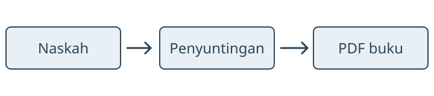

# Praktik {#sec-praktik}

Bab ini melanjutkan @sec-dasar.

## Tabel dengan caption

@tbl-tahapan merangkum tahapan pembuatan buku. Label `tbl-tahapan`
memungkinkan nomor tabel diperbarui otomatis saat urutan tabel berubah.

| Tahap | Kegiatan | Hasil |
|:------|:---------|:------|
| Penulisan | Menyusun bab | Naskah awal |
| Penyuntingan | Memeriksa isi dan bahasa | Naskah final |
| Penerbitan | Merender proyek | PDF buku |

: Tahapan pembuatan buku contoh. {#tbl-tahapan}

## Gambar dengan caption

@fig-alur memperlihatkan alur dari naskah hingga PDF, sesuai tahapan pada
@tbl-tahapan.

{#fig-alur width=100% fig-alt="Tiga kotak berurutan: Naskah, Penyuntingan, dan PDF buku, dihubungkan panah."}

## Sitasi dan lampiran

Sebagai contoh sitasi bibliografis, pembahasan sistem penataan teks TeX
dapat ditemukan dalam @knuth1984. Entri lengkapnya muncul pada bagian
Referensi, berdasarkan berkas `references.bib`.

Daftar periksa tambahan tersedia pada [Lampiran](lampiran.qmd#sec-lampiran-periksa).

## Latihan

1. Ganti judul buku.
2. Tambahkan bab.
3. Render menjadi PDF.
